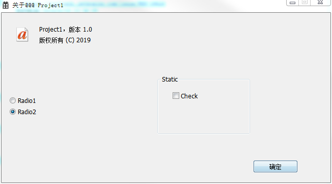
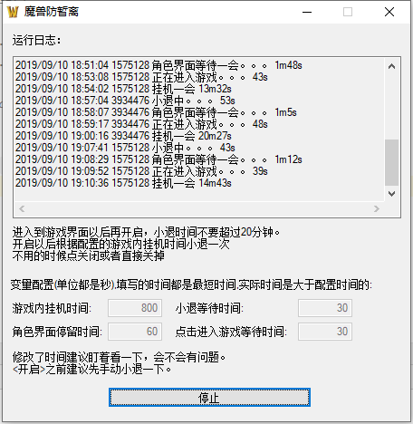
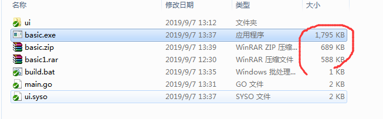
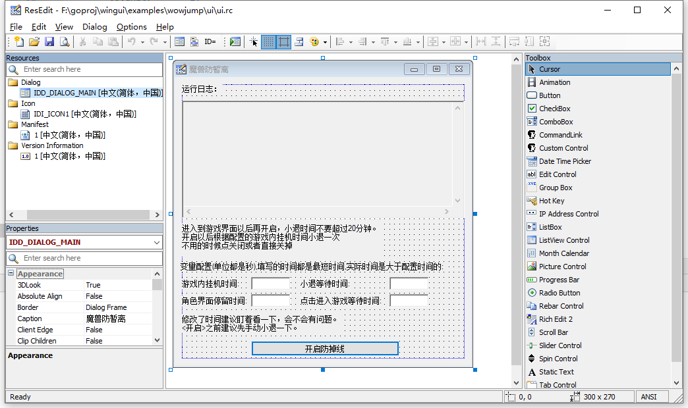
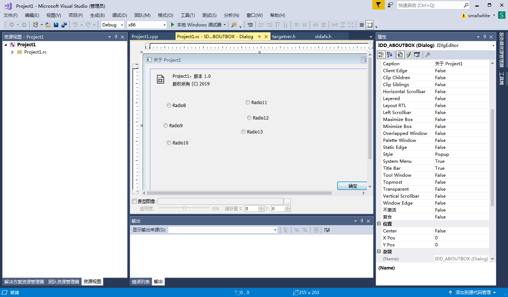

# Windows GUI Library  - wingui


[](https://goreportcard.com/report/github.com/whtiehack/wingui)
[](https://godoc.org/github.com/whtiehack/wingui)


[](https://github.com/whtiehack/wingui/actions)

Golang GUI library for windows, UI created by ResEdit or Visual Studio Resource Editor

Lightweight, high performance and small executable file size Windows GUI library.

# UI Design tool

> ResEdit

> Visual Studio Resource Editor

> Other dialog box editor


# Requires

### GCC (Optionally, windres.exe can be used to generate a syso file from res or rc.)

MinGW
http://www.mingw.org

or 

TDM-GCC
http://tdm-gcc.tdragon.net/


#### windres.exe

This tool in `TDM-GCC-64/bin/windres.exe`,don't know where in MinGW.

You can also use rc.exe and link.exe to generate syso file.

# Usage

### Simple usage:

> example for https://github.com/whtiehack/wingui/tree/master/examples/simple

Generate `x.syso` file from rc or res file use `windres.exe` tool.

generate `syso` file:

`windres -i emptyProject/Debug/resource.res -O coff -o vsui.syso`

or

`windres -i ui/ui.rc -O coff -o ui.syso`


main.go
```go
package main

import "github.com/whtiehack/wingui"

func main() {
	dlg, _ := wingui.NewDialog(101, 0, nil)
	dlg.SetIcon(105)
	btnok, _ := wingui.BindNewButton(1002, dlg)
	btncancel, _ := wingui.BindNewButton(1003, dlg)
	btnok.OnClicked = func() {
		dlg.Close()
	}
	btncancel.OnClicked = btnok.OnClicked
	dlg.Show()
	// This invoke is optional.
	wingui.SetCurrentDialog(dlg.Handle())
	wingui.MessageLoop()
}


```


run:
`go run .`

Don't use `go run main.go`, because golang can't load x.syso files.


[More examples](https://github.com/whtiehack/wingui/tree/master/examples)

# Examples

see https://github.com/whtiehack/wingui/tree/master/examples

Welcome PRs.


# References 

https://github.com/lxn/walk

https://github.com/sumorf/gowi


https://docs.microsoft.com/zh-cn/windows/win32/

https://docs.microsoft.com/zh-cn/windows/win32/uxguide/controls

https://docs.microsoft.com/zh-cn/windows/win32/controls/window-controls

# Screenshot


### Effect




### File size



### ResEdit



[ResEdit Download](http://www.resedit.net/)


### Visual Studio Resource Editor




# TODOs

<details><summary><b> click to show </b> </summary><br>


- [x] Edit
- [x] Static Text

- [x] Image
- [x] ComboBoxx
- [x] ListBox

-----

##### Button
- [x] PushButton
- [x] CheckBox
- [x] Radio Button

-----
- [x] Slider Control
- [x] Progress Bar
- [ ] Tab Control

- [ ] ListView Control

- [ ] Spin Control

- [ ] Rich Edit

- [ ] DateTimePicker
- [ ] Month Calendar
- [ ] TreeView Control

- [ ] Hot Key
- [ ] Accelerator
- [ ] Menu

</details>


## Recommend

If you need to do complex GUI programs, you can use [govcl](https://github.com/ying32/govcl) or [walk](https://github.com/lxn/walk).


